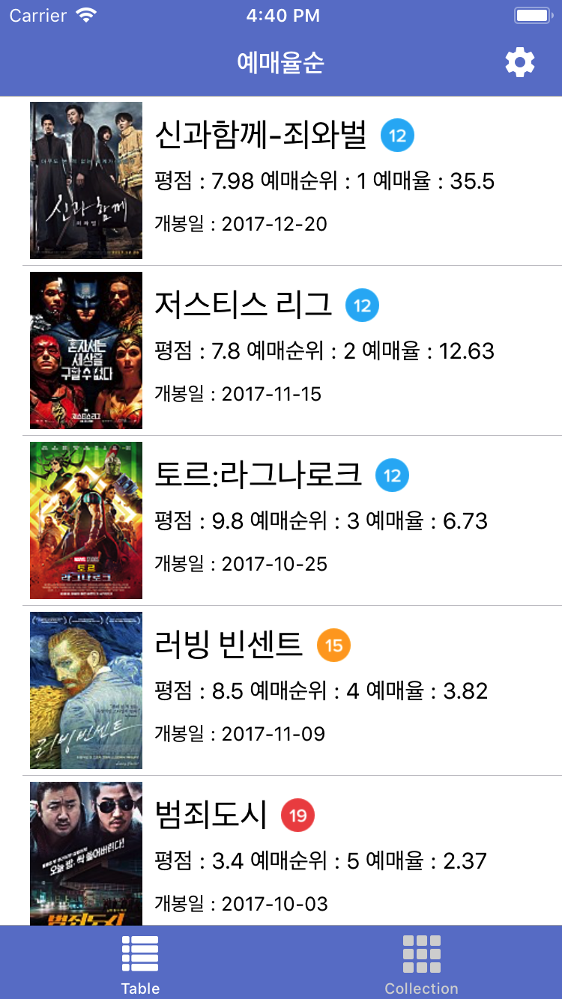
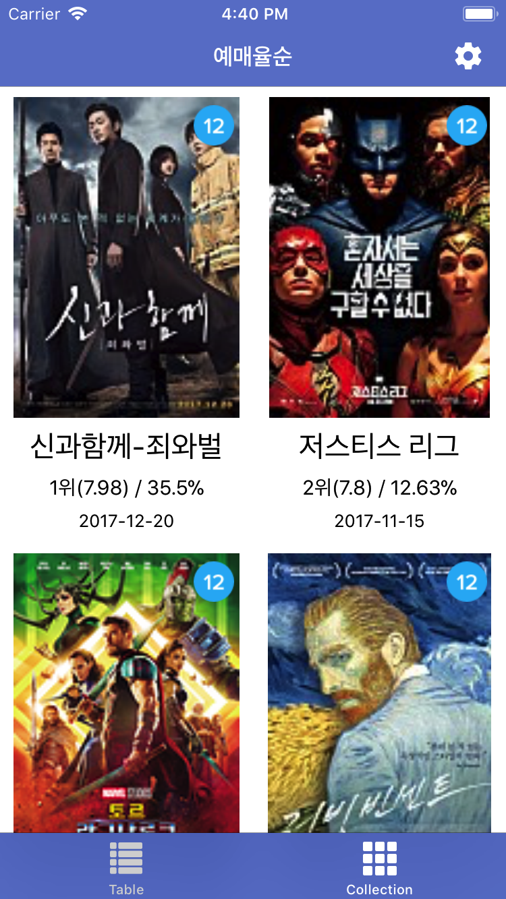
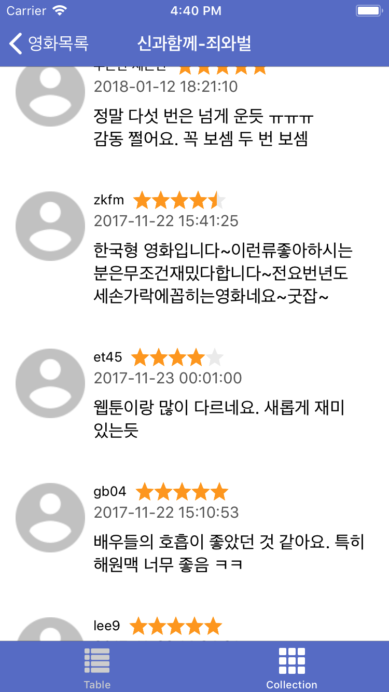
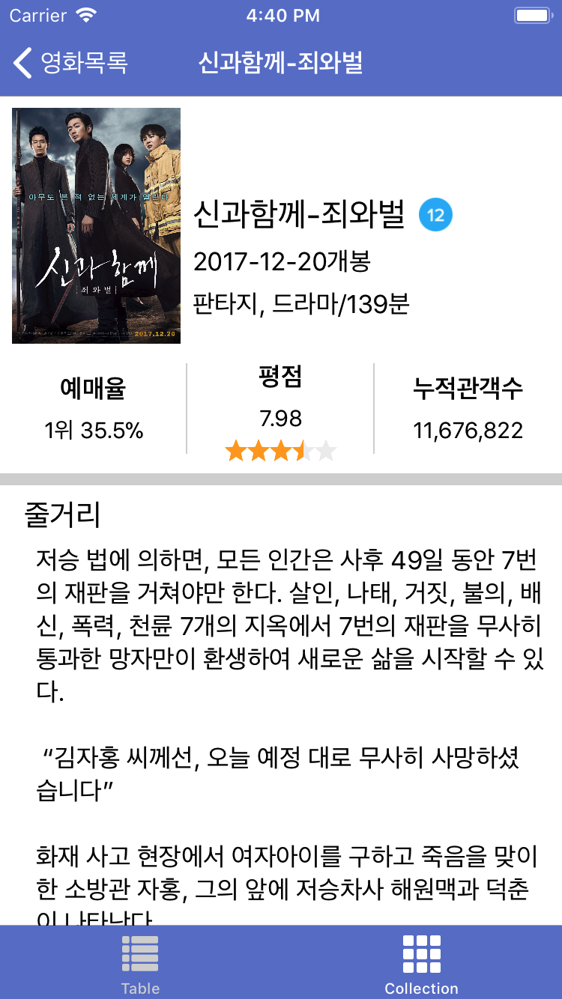

# 영화 박스오피스 앱
## 설명
- 서버의 API를 통해 영화 정보를 요청하고 가져옵니다.
- 가져온 정보를 테이블뷰와 컬렉션뷰를 활용하여 화면에 표현해줍니다.
- 영화 목록 중 원하는 영화를 선택하면 상세 정보를 볼 수 있습니다.

## 요구사항
- 아래와 같이 예시를 따라서 2가지 화면을 구성하고 기능을 구현하면 됩니다.
- 서버에 요청하는 과정은 애플 프레임워크만 활용해서 작업해야 합니다.
- 이미지를 화면 표시와 별개로 백그라운드에서 다운받아서 표시해야 합니다.

#### 선택요구사항 
- 선택요구사항을 구현하는 경우에는 가산점이 있습니다.
- 네트워크 동작중에는 상태표시줄이나 화면에 인디케이터를 표시하세요.
- 데이터 수신을 못하고 실패한 경우에는 알림창으로 사용자에게 안내하세요.

### 화면1 - 영화목록

|                영화목록1                 |                영화목록2                 |
| :--------------------------------------: | :--------------------------------------: |
|  |  |

#### 화면구성
- 탭 인터페이스와 내비게이션 인터페이스의 결합 형태입니다.
- 첫 번째 탭은 'Table', 두 번째 탭은 'Collection' 타이틀로 구성합니다.
- 첫 번째 탭 화면은 테이블형태로, 두 번째 탭 화면은 컬렉션 형태로 같은 데이터를 사용하여 콘텐츠를 표시합니다.
- 테이블 화면
	- 테이블뷰 셀에 영화 포스터를 보여줍니다.
	- 포스터 오른편에 영화정보(제목, 등급, 평점, 예매순위, 예매율, 개봉일)를 보여줍니다.
- 컬렉션 화면
	- 컬렉션뷰 셀에 영화 포스터와 등급을 함께 보여줍니다.
	- 포스터 아래 영화정보(제목, 평점, 순위, 예매율, 개봉일)를 보여줍니다.
- 내비게이션 아이템의 타이틀은 영화 정렬기준을 표시합니다.
- 내비게이션바 오른쪽 부분에는 내비게이션 아이템으로 바 버튼이 있습니다.
	- 바 버튼은 정렬방식을 선택하기 위한 버튼입니다.

#### 기능 
- 화면 오른쪽 상단 바 버튼을 눌러 정렬방식을 변경할 수 있습니다. (예매율/큐레이션/개봉일 기준)
	- 테이블뷰와 컬렉션뷰의 영화 정렬방식은 동일하게 적용됩니다. 즉, 한 화면에서 변경하면 다른 화면에도 변경이 적용되어 있어야 합니다.
- 테이블뷰와 컬렉션뷰를 아래쪽으로 잡아당기면 새로고침됩니다.
- 테이블뷰/컬렉션뷰의 셀을 누르면 해당 영화의 상세 정보를 보여주는 화면 2로 전환합니다.

### 화면2 - 영화 상세 정보

| 영화 상세정보 1                          | 영화 상세정보 2                          |
| ---------------------------------------- | ---------------------------------------- |
|  |  |


#### 화면구성
- 화면2 내비게이션 아이템 타이틀은 이전 화면에서 선택된 영화 제목입니다.
- 영화 상세정보 화면을 구현합니다.
- 영화 포스터를 포함한 소개, 줄거리, 감독/출연 그리고 한줄평을 모두 포함합니다.
- 한줄평에는 작성자의 프로필, 닉네임, 별점, 작성일 그리고 평을 보여줍니다.

#### 기능 
- 영화 포스터를 터치하면 포스터를 전체화면에서 볼 수 있습니다.

- 실행영상


# 서버 API

- Base-URL http://connect-boxoffice.run.goorm.io/

#### 영화목록

- sub-URL `/movies`
- HTTP Method `GET`
- Request Parameters

|이름|타입|비고|
|---|---|---|
| order_type |Int|   0: 예매율(default) 1: 큐레이션 2: 개봉일|

- Request Sample
`http://connect-boxoffice.run.goorm.io/movies?order_type=1`

- Response
Type : JSON
Success Status Code : 200

- JSON 객체

| Key | Value Type |비고|
|---|---|---|
|grade|Int|관람등급 <br> 0: 전체이용가 <br> 12: 12세 이용가 <br> 15: 15세 이용가 <br> 19: 19세 이용가|
| thumb | String |포스터 이미지 섬네일 주소|
| reservation_grade | Int | 예매순위 |
| title | String | 영화제목 |
| reservation_rate | Double | 예매율 |
| user_rating | Double | 사용자 평점 |
| date | String | 개봉일 |
| id | String |영화 고유 ID|


 - Response Sample

```json
 [{
grade: 12,
     thumb: "http://movie.phinf.naver.net/20171201_181/1512109983114kcQVl_JPEG/movi
 e_image.jpg?type=m99_141_2",
reservation_grade: 1, title: "신과함께-죄와벌", reservation_rate: 35.5, user_rating: 7.98, date: "2017-12-20",
     id: "5a54c286e8a71d136fb5378e"
 },
{
grade: 12,
     thumb: "http://movie2.phinf.naver.net/20170925_296/150631600340898aUX_JPEG/mov
 ie_image.jpg?type=m99_141_2",
 reservation_grade: 2,
title: "저스티스 리그", reservation_rate: 12.63, user_rating: 7.8,
date: "2017-11-15",
     id: "5a54c1e9e8a71d136fb5376c"
 }]
```

#### 영화 상세정보
- Sub URI `/movie`
- HTTP Method `GET`
- Request Parameters
|이름|타입|비고|
|---|---|---|
| id | String |영화 고유 ID|

- Request Sample
`http://connect-boxoffice.run.goorm.io/movie?id=5a54c286e8a71d136fb5378e`

- Response
  Type : JSON
  Success Status Code : 200

- JSON 객체

| Key | Value Type | 비고 |
|---|---|---|
| audience | Int |총 관람객수|
| actor | String | 배우진 |
| duration | Int |영화 상영 길이|
| director | String | 감독 |
| synopsis | String | 줄거리 |
| genre | String | 영화 장르 |
| grade | Int | 관람등급 <br> 0: 전체이용가 12: 12세 이용가 15: 15세 이용가 19: 19세 이용가 |
| image | String | 포스터 이미지 주소|
| reservation_grade | Int | 예매순위 |
| title | String | 영화제목 |
| reservation_rate | Double | 예매율 |
| user_rating | Double | 사용자 평점 |
| date | String | 개봉일 |
| id | String | 영화 고유 ID|

 - Response Sample

```json
  {
audience: 11676822,
grade: 12,
actor: "하정우(강림), 차태현(자홍), 주지훈(해원맥), 김향기(덕춘)",
duration: 139,
reservation_grade: 1,
title: "신과함께-죄와벌",
reservation_rate: 35.5,
user_rating: 7.98,
date: "2017-12-20",
director: "김용화",
id: "5a54c286e8a71d136fb5378e",
image: "http://movie.phinf.naver.net/20171201_181/1512109983114kcQVl_JPEG/movi
e_image.jpg",
synopsis: "저승 법에 의하면, (중략) 고난과 맞닥뜨리는데... 누구나 가지만 아무도 본 적 없는 곳, 새로
운 세계의 문이 열린다!", genre: "판타지, 드라마"
}
```

#### 한줄평 목록
- Sub URI `/comments`
- HTTP Method `GET`
- Request Parameters

| 이름 | 타입 | 비고 |
|---|---|---|
| movie_id | String |한줄평이 해당하는 영화 고유ID |

- Request Sample
`http://connect-boxoffice.run.goorm.io/comments?movie_id=5a54c286e8a71d136fb5378e`

- Response
Type : JSON
Success Status Code : 200
JSON 객체

| Key | Value Type | 비고 |
|---|---|---|
| rating | Double | 평점 |
| timestamp | Double | 작성일시 UNIX Timestamp 값 |
| writer | String | 작성자 |
| movie_id | String |영화 고유ID|
| contents | String | 한줄평 내용|

- Response Sample

```json
 [{
     rating: 10,
timestamp: 1515748870.80631,
writer: "두근반 세근반",
movie_id: "5a54c286e8a71d136fb5378e",
contents:"정말 다섯 번은 넘게 운듯 ᅲᅲᅲ 감동 쩔어요.꼭 보셈 두 번 보셈"
}, 
{ timestamp: 1511332885,
movie_id: "5a54c286e8a71d136fb5378e",
writer: "zkfm",
rating: 9.1,
contents: "한국형 영화입니다~이런류좋아하시는분은무조건재밌다합니다~전요번년도 세손가락에꼽히는영화네요 ~굿잡~" 
}]
```

# 과제제출 방법
- 과제 저장소를 본인의 Github 계정에 과제 저장소를 만들어서 작업하고 저장소 주소를 제출


# 기타
- 과제구현 질문은 [Issues탭](https://github.com/code-squad/boost-camp-3-ios/issues)에 등록해주시면 답변드립니다.
